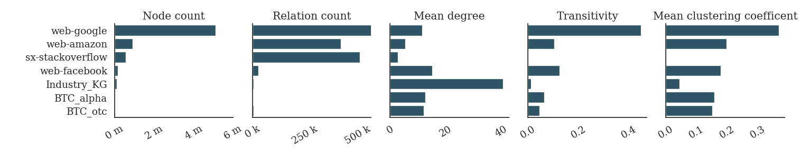

<h1 align="center">
  Cluster Robust Mean Reciprocal Rank
</h1>

<p align="center">
  <a href="https://github.com/pykeen/pykeen/actions">
    
  </a>

  <a href='https://opensource.org/licenses/MIT'>
    
  </a>

</p>

<p align="center">
    <b>CRMRR</b> (<b>C</b>luster <b>R</b>obust <b>M</b>ean <b>R</b>eciprocal <b>R</b>ank) is a novel rank-based metric for the evaluation of embedding-based Knowledge Graph Completion models.
</p>

<p align="center">
  <a href="#installation">Installation</a> •
  <a href="#quickstart">Quickstart</a> •
  <a href="#implementation">Implementation</a> •
  <a href="#experiments">Experiments</a> •
  <a href="#citation">Citation</a>
  <a href="#contributing">Contributing</a> •
</p>

## Installation

### Installation of requirements
The requirements for this repository can be installed from GitHub using with:

```shell
pip install -r https://raw.githubusercontent.com/simoncharmms/crmrr/requirements.txt
```

### Installation of PyKeen  

For this demonstration, the python library PyKeen is required. We reccomend to install the latest version of PyKEEN installed directly from the
source code on [GitHub](https://github.com/pykeen/pykeen) with:

```shell
pip install git+https://github.com/pykeen/pykeen.git
```

and then downgrade to the version we used, which is `pykeen==1.10.1`.

## Quickstart

This example shows how to train three different Knowledge Graph (KG) embedding models on a dataset and test the Cluster Robust Mean Reciprocal Rank (CRMRR) against other rank-based metrics.

The following example trains and evaluates the embedding models [ComplEx](https://pykeen.readthedocs.io/en/latest/api/pykeen.models.ComplEx.html),
[TransR](https://pykeen.readthedocs.io/en/latest/api/pykeen.models.TransR.html) and [DistMult](https://pykeen.readthedocs.io/en/latest/api/pykeen.models.DistMult.html) using the PyKeen library.

Different from the PyKeen default settings, we use the [stochastic local closed world assumption (sLCWA)](https://pykeen.readthedocs.io/en/latest/reference/training.html#pykeen.training.SLCWATrainingLoop)
training approach. Furthermore, we evaluate the embeddings with PyKeens [rank-based evaluation](https://pykeen.readthedocs.io/en/latest/reference/evaluation/rank_based.html#pykeen.evaluation.RankBasedEvaluator), which includes the [Mean Rank (MR)](https://pykeen.readthedocs.io/en/stable/tutorial/understanding_evaluation.html#mean-rank), the [Mean Reciprocal Rank (MRR)](https://en.wikipedia.org/wiki/Mean_reciprocal_rank)  and [Hits @ K](https://pykeen.readthedocs.io/en/stable/tutorial/understanding_evaluation.html#hits-k) (whereby K = 10), before we compute the CRMRR.

The experiments can be reproduced using the following commands:

```python
from main import main

result = main(
    models = ['TransR', 'DistMult', 'ComplEx']
)
```

For this quickstart, standard settings as described in  `src/constants.py` apply.
The results are returned and stored as a dataframe `result`. 
Additionally, plots are produced, unless you set `PLOTS = False`in `src/constants.py`

## Implementation

Below are the implementation logic of CRMRR as well as some notes on models, datasets, training modes, evaluators, and metrics implemented
in ``pykeen``.

### Cluster Robust Inference
In embedding-based KG Completion (KGC), the restriction of the model to learning completion candidates from existing triplets in the graph is a problem under the Open World Assumption.
Rank-based metric for KGC do not reflect this problem and thus convey only the likelihood of a true completion candidate given the existing triples.
We propose a novel rank-based metric that reflects this circumstance based on the assumption of [cluster robust inference](https://www.sciencedirect.com/science/article/pii/S0304407622000781).
Let $MRR (r_1, ..., r_n)$ be the MRR of all completion candidates scored by a scoring function $f_r(h,t)$ of an embedding-based KGC model $\phi$ on a clustered KG. 
Then, the *Cluster-Robust Mean Reciprocal Rank* is 

$$ CRMRR (r_1, ..., r_n) = \underbrace{{1  \over n} \sum_{i=1}^{n} \sum_{j=1}^{m} {r_{i}^{-1} } }_{MRR (r_1, ..., r_n)} $$

$$+ \underbrace{{\lvert c \rvert}^{ - \left( {r_{j \vert cc} \over n} \right) } - 1 }_{Penalty term} $$ 

where $n$ is the total count of ranks $r_{i}$. $\lvert c \rvert$ is the count of clusters of a clustered KG. $m$ is the count of cross-cluster ranks $r_{j \vert cc}$ from cross-cluster completion candidates $(h,r,t)_{cc}$.

The penalty term of the *CRMRR* shows beneficial behavior for the choice of the most realistic embedding model under the assumption of cluster robust errors, penalizing less for the case of few clusters and stronger the higher the given rank.

<a>
  
</a>

The implementation of the CRMRR can be found in `src/cluster_robust_mean_reciprocal_rank.py`.

### Graph Clustering

The [Leiden algorithm](https://github.com/vtraag/leidenalg) assigns nodes to arbitrary communities and then optimizes an objective function 

$$H_{Leiden} = {1 \over 2m} \sum_{ij} (A_{ij} - \gamma n_i n_j) \delta ( \sigma_i, \sigma_j)$$

where $\sigma$ is the cluster of a respective node $i$ or $j$, which leads to $\delta ( \sigma_i, \sigma_j) = 1$ if and only if $\sigma_i = \sigma_j$, $0$ otherwise. 
We chose the Leiden algorithm,  because $A_{ij}$, can also carry weights of relations from node $i$ to node $j$ as $n_i$, which renders the Leiden algorithm a graph clustering algorithm that can also take on weighted graphs.

The `src/cluster_graphs.py` file contains all methods required for graph clustering.

### Embedding-based Knowledge Graph Completion

The following 3 embedding models are used for testing CRMRR.

| Name                           | Model                                                                                                                                 | Interaction                                                                                                                                 | Citation                                                                                                                |
|--------------------------------|---------------------------------------------------------------------------------------------------------------------------------------|---------------------------------------------------------------------------------------------------------------------------------------------|-------------------------------------------------------------------------------------------------------------------------|
| ComplEx                        | [`pykeen.models.ComplEx`](https://pykeen.readthedocs.io/en/latest/api/pykeen.models.ComplEx.html)                                     | [`pykeen.nn.ComplExInteraction`](https://pykeen.readthedocs.io/en/latest/api/pykeen.nn.ComplExInteraction.html)                             | [Trouillon *et al.*, 2016](https://arxiv.org/abs/1606.06357)                                                            |
| DistMult                       | [`pykeen.models.DistMult`](https://pykeen.readthedocs.io/en/latest/api/pykeen.models.DistMult.html)                                   | [`pykeen.nn.DistMultInteraction`](https://pykeen.readthedocs.io/en/latest/api/pykeen.nn.DistMultInteraction.html)                           | [Yang *et al.*, 2014](https://arxiv.org/abs/1412.6575)                                                                  |
| TransR                         | [`pykeen.models.TransR`](https://pykeen.readthedocs.io/en/latest/api/pykeen.models.TransR.html)                                       | [`pykeen.nn.TransRInteraction`](https://pykeen.readthedocs.io/en/latest/api/pykeen.nn.TransRInteraction.html)                               | [Lin *et al.*, 2015](http://www.aaai.org/ocs/index.php/AAAI/AAAI15/paper/download/9571/9523/)                           |

### Metrics

The following metrics are used as a benchmark for CRMRR.

| Name                                                                                                       | Interval | Direction   | Description                                                 | Type           |
|------------------------------------------------------------------------------------------------------------|----------|-------------|-------------------------------------------------------------|----------------|
| [Hits @ K](https://pykeen.readthedocs.io/en/stable/tutorial/understanding_evaluation.html#hits-k)          | [0, 1]   | 📈           | The relative frequency of ranks not larger than a given k.  | Ranking        |
| [Mean Rank (MR)](https://pykeen.readthedocs.io/en/stable/tutorial/understanding_evaluation.html#mean-rank) | [1, ∞)   | 📉           | The arithmetic mean over all ranks.                         | Ranking        |
| [Mean Reciprocal Rank (MRR)](https://en.wikipedia.org/wiki/Mean_reciprocal_rank)                           | (0, 1]   | 📈           | The inverse of the harmonic mean over all ranks.            | Ranking        |
||||||
| **Cluster Robust  Mean Reciprocal Rank (MRR)**                                                             | (-∞, ∞)  | 📈           | The inverse of the harmonic mean over all ranks.            | Ranking        |

## Experiments

Note that reproducing the full expirments from the paper can take a considerable amount of training time. 
Therefore, the in `constants.py` you can specify whether you want to sample the data and to what extent:

```python
# Indicate whether to sample the data or not.
SAMPLE = True
# Specify sample ratio.
SAMPLE_RATIO = 0.001
```
Furthermore, we provide some pre-trained embeddings in `models`.

### Datasets 

The following datasets were retrieved from [`SNAP`](https://snap.stanford.edu/data/) and selected to match optimal coverage of different sizes, degrees and clustering behaviour.

| Name             | Documentation                                                                                                                                       | Citation                                                                      | Relations | Nodes   |
|------------------|-----------------------------------------------------------------------------------------------------------------------------------------------------|-------------------------------------------------------------------------------|-----------|---------|
| web-google       | [`Pages and directed edges represent hyperlinks between them.`](https://snap.stanford.edu/data/web-Google.html)                                     | [J. Leskovec *et al*., 2009](https://arxiv.org/abs/0810.1355)                 | 875 kk    | 5,105 k |
| web-amazon       | [`Amazon reviews up to 2013.`](https://snap.stanford.edu/data/web-Amazon.html)                                                                      | [McAuley and Leskovec, 2013](http://i.stanford.edu/~julian/pdfs/recsys13.pdf) | 273 k     | 925 k   |
| sx-stackoverflow | [`Interactions on the stack exchange web site Stack Overflow.`](https://snap.stanford.edu/data/sx-stackoverflow.html)                               | [Paranjape *et al*., 2017](https://arxiv.org/abs/1612.09259)                  | 482 k     | 634 k   |
| musae-facebook   | [`Facebook pages and links between them.`](https://snap.stanford.edu/data/facebook-large-page-page-network.html)                                    | [Rozemberczki *et al*., 2019](https://arxiv.org/abs/1909.13021)               | 27 k      | 171 k   |
| Industry KG      | [`Automotive vehicle names and sales countries.`](https://data.mendeley.com/datasets/gyfpsb8t4n/3)                                                  | [Schramm, 2023](https://data.mendeley.com/drafts/gyfpsb8t4n)                  | 5 k       | 116 k   |
| BTC alpha        | [`Trust network of people who trade using Bitcoin on a platform called Bitcoin Alpha.`](https://snap.stanford.edu/data/soc-sign-bitcoin-alpha.html) | [Kumar *et al*., 2018](https://dl.acm.org/doi/pdf/10.1145/3159652.3159729)    | 2 k       | 3 k     |
| BTC otc          | [`Trust network of people who trade using Bitcoin on a platform called Bitcoin OTC.`](https://snap.stanford.edu/data/soc-sign-bitcoin-otc.html)     | [Kumar *et al*., 2018](https://dl.acm.org/doi/pdf/10.1145/3159652.3159729)    | 5 k       | 3 k     |

**ATTENTION: Please use the links above to fetch web-google and sx-stackoverflow, those datasets are not pushed to GitHub due to file size.**

The benchmark datasets cover a variety of KGs and differ in node count, relation count, mean degree, transitivity and clustering coefficient.

  <a>
    
  </a>

The `src/get_benchmark_datasets.py` file contains all methods required for data loading.

### Stopper, Optimizer and evaluator

For the experiments, the following stopper, optimizer and evaluator were chosen:

|           | Reference                                                                                               | Description                   |
|-----------|---------------------------------------------------------------------------------------------------------|-------------------------------|
| Stopper   | [`early`](https://pykeen.readthedocs.io/en/latest/reference/stoppers.html#pykeen.stoppers.EarlyStopper) | A harness for early stopping. |
| Optimizer | [`Adam`](https://pykeen.readthedocs.io/en/latest/api/pykeen.evaluation.RankBasedEvaluator.html)         | A rank-based evaluator for KGE models.                                   |
| Evaluator | [`rankbased`](https://pykeen.readthedocs.io/en/latest/api/pykeen.evaluation.RankBasedEvaluator.html)    | A rank-based evaluator for KGE models.                                   |

### Results
Experiments on the benchmark datasets yielded the following results:

* $CRMRR$ outperformed $MR$, $MRR$ and $H_{10}$ in 71\% of the cases. 
* $CRMRR$ tends to perform well on large \acp{kg}. 
* The exploration of other \ac{kgc} methods, such as Tensor Factorization or Rule Based approaches are promising, due to the model-agnostic properties of $CRMRR$.


<a>
  
</a>

## Citation

We implemented a benchmarking study which is described in
[our article](https://doi.org/10.1007/978-3-031-40283-8_25).
If you find CRMRR useful, consider citing our work as follows:

```bibtex
@InProceedings{10.1007/978-3-031-40283-8_25,
author={Schramm, Simon and Niklas, Ulrich and Schmid, Ute},
editor= {Jin, Zhi and Jiang, Yuncheng and Buchmann, Robert Andrei and Bi, Yaxin and Ghiran, Ana-Maria and Ma, Wenjun},
title= {Cluster Robust Inference for Embedding-Based Knowledge Graph Completion},
booktitle= {Knowledge Science, Engineering and Management},
year= {2023},
publisher= {Springer Nature Switzerland},
address= {Cham},
pages= {284--299},
isbn= {978-3-031-40283-8}
}
```

## Contributing

Contributions, whether filing an issue, making a pull request, or forking, are appreciated.
See [my website](https://simoncharmms.github.io/home/index.html#contact) for more information on potential research cooperations.

## Acknowledgements

This project has been supported by the [BMW Group](https://www.bmw.com/).
